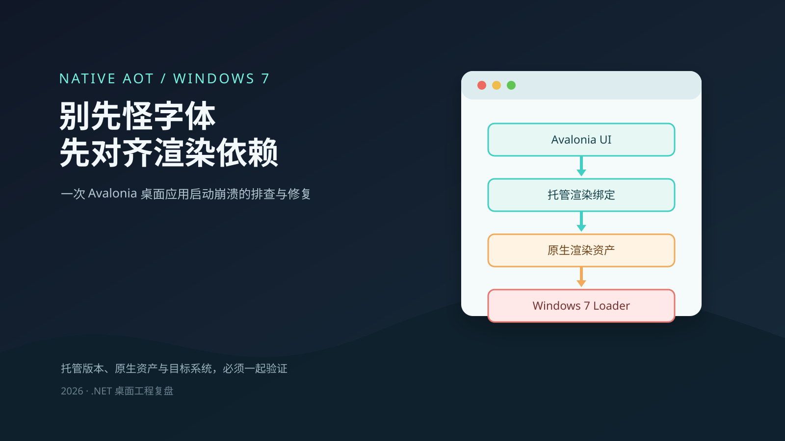
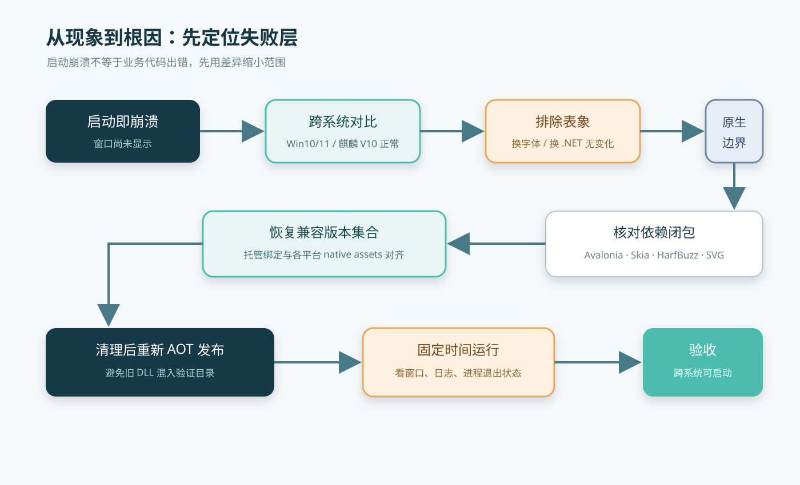
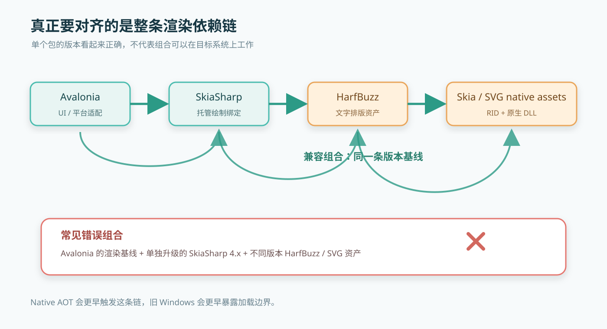
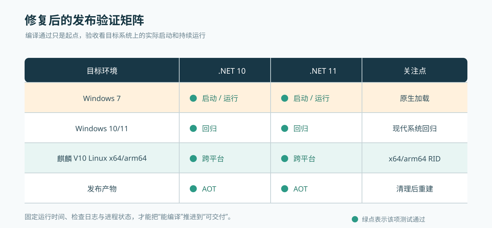

## 问题背景

本文分享一次基于 Avalonia 的跨平台桌面程序在 Windows 7 上启动崩溃的排查过程。程序采用 Native AOT 发布。

升级 Avalonia 和底层渲染依赖后，程序仅在 Windows 7 上启动失败，Windows 10/11 和麒麟 V10 Linux x64/arm64 均正常；切换 .NET 10 / .NET 11、改用微软雅黑字体也没有解决问题。日志表面指向字体管理器，最终根因是渲染依赖和原生资产版本没有对齐。



## 1. 现象与日志

启动阶段的异常日志通常只告诉我们“程序没有起来”，不一定告诉我们最早失败的那一层。

这次现象有三个很重要的信号：

- 崩溃发生在窗口真正显示之前。
- Windows 10/11 和麒麟 V10 Linux x64/arm64 可以运行，Windows 7 不行。
- 更换字体、切换 .NET 10 / .NET 11，结果没有变化。

第三个信号尤其关键。字体属于界面资源层，.NET 10 和 .NET 11 属于托管运行时层；如果两者都不能改变结果，就应该把视线移到更早加载的公共渲染依赖和原生 DLL 上。

### 1.1 先看最短堆栈

原始日志很长，但排查时不必一开始把整段堆栈都贴出来。保留最靠近根因的部分，信息密度更高。下面是脱敏后的关键片段，仓库名、程序名和入口类型均已替换：

```text
2026-09-23 16:38:14.069 [严重错误] DesktopModeler startup failed.
System.NullReferenceException: Object reference not set to an instance of an object.
   at Avalonia.Skia.FontManagerImpl.TryCreateGlyphTypeface(...)
   at Avalonia.Media.Fonts.FontCollectionBase.TryAddFontSource(...)
   at Avalonia.Media.FontManager.TryGetGlyphTypeface(...)
   at Avalonia.Media.TextFormatting.TextCharacters.CreateShapeableRun(...)
   at Avalonia.Controls.TextBlock.MeasureOverride(Size availableSize)
   at Avalonia.Controls.Window.Show()
   at Prism.PrismApplicationBase.Initialize()
   at DemoApp.Program.Main(String[] args)
```

另一份系统错误日志的起点略有不同，但仍然落在同一条链路：

```text
System.NullReferenceException: Object reference not set to an instance of an object.
   at Avalonia.Media.Fonts.SystemFontCollection..ctor(IFontManagerImpl)
   at Avalonia.Media.FontManager.get_SystemFonts()
   at Avalonia.Media.Typeface.get_GlyphTypeface()
   at Avalonia.Controls.TextBlock.MeasureOverride(Size availableSize)
```

这两段日志最值得关注的不是异常类型，而是调用顺序：字体管理器初始化 → 字形解析 → 文字排版 → `TextBlock` 测量 → 窗口首次布局。它说明错误出现在 UI 第一次布局触发渲染链的时刻，而不是某个业务 `ViewModel` 的按钮命令里。

### 1.2 启动代码看起来并没有问题

脱敏后的启动入口大致只有下面这些结构：

```csharp
internal static class DemoProgram
{
    public static void Main(string[] args)
    {
        BuildAvaloniaApp()
            .StartWithClassicDesktopLifetime(args);
    }

    private static AppBuilder BuildAvaloniaApp() =>
        AppBuilder.Configure<App>()
            .UsePlatformDetect()
            .With(new FontManagerOptions
            {
                DefaultFamilyName = "DefaultSans"
            })
            .LogToTrace();
}
```

这也是为什么第一反应容易落到字体上：启动入口里确实有字体配置，堆栈里也确实出现了字体类。但“错误在哪里被观察到”和“哪个依赖把它触发出来”不是一回事。换字体没有改变失败位置，反而说明应该继续向下检查渲染绑定和原生资产。



## 2. 原理：Native AOT 与渲染依赖链

普通 JIT 发布时，程序集和原生库往往在运行到相关功能时才逐步加载。Native AOT 会把更多依赖关系提前固化到发布产物和启动路径中，渲染框架初始化也更早发生。

所以一个依赖问题可能出现两种表现：

```text
普通发布：启动成功，打开某个页面或执行绘制时失败

Native AOT：启动阶段就失败，应用还没有机会显示窗口
```

这不是 Native AOT “制造”了错误，而是它把原本隐藏在后续路径里的不一致提前暴露出来。旧系统又有更严格的原生库加载条件，于是最先表现为 Win7 启动崩溃。

### 2.1 真正的边界在渲染依赖链

Avalonia 的控件层不会独立完成绘制。应用看到的是 Avalonia API，底层还要经过渲染适配层、SkiaSharp 托管绑定、Skia 原生资产，以及文字排版所需的 HarfBuzzSharp。

SVG 相关组件还会继续依赖同一套 Skia 生态。只升级其中一个包，依赖图就可能变成“表面版本很新，底层资产并不匹配”。



这次升级 Avalonia 后，应用侧把 SkiaSharp 单独推进到了 4.x，而 Avalonia 12.1.3 所使用的渲染基线并不是这组组合。Windows 10/11 和麒麟 V10 Linux x64/arm64 的运行环境没有立即暴露问题，并不能证明依赖是正确的；它们只是没有在同一个位置失败。

## 3. 修复：整体对齐依赖

最终采用的是“按渲染栈整体对齐”的方式：

| 层级 | 对齐原则 |
| --- | --- |
| Avalonia | 以当前 UI 框架版本的实际传递依赖为基线 |
| SkiaSharp | 与 Avalonia.Skia 及各平台 native assets 使用兼容版本 |
| HarfBuzzSharp | 与文字渲染绑定及原生资产保持同一版本线 |
| Svg.Skia | 不跨越当前 SkiaSharp 兼容范围 |
| 绘制 API | 使用当前基线稳定支持的 API，避免混用更高版本专用类型 |

本次实际恢复到兼容组合：SkiaSharp 3.119.4、HarfBuzzSharp 8.3.1.3、Svg.Skia 5.1.1，并将一处依赖 SkiaSharp 4 专用构造方式的绘制逻辑改为兼容基线支持的路径 API。

这里的重点不是记住几个版本号，而是理解：

> UI 框架、托管绑定、原生资产和绘制 API 必须作为一个版本集合升级。

如果只看中央包管理文件中的“最高版本”，很容易把一条渲染链拆成几个互相不认识的版本分支。

把版本关系写成一个最小化的中央配置，思路会更直观：

```xml
<ItemGroup>
  <PackageVersion Include="Avalonia" Version="12.1.3" />
  <PackageVersion Include="SkiaSharp" Version="3.119.4" />
  <PackageVersion Include="HarfBuzzSharp" Version="8.3.1.3" />
  <PackageVersion Include="Svg.Skia" Version="5.1.1" />
</ItemGroup>
```

这里的重点是版本集合，而不是这几行 XML 本身。任何一个组件单独跨到另一条主版本线，都应该重新核对 Avalonia 的传递依赖、各 RID 的 native assets，以及 AOT 发布后的实际文件。

### 3.1 为什么字体不是根因

字体问题通常会产生缺字、回退、字形错乱、字重异常或文本测量偏差。它们发生在字体管理器已经启动之后。

这次故障发生在渲染栈初始化和原生库装载阶段，窗口还没有进入正常绘制流程。把字体改成微软雅黑可以作为兼容性试验，但不能替代对 Skia、HarfBuzz 和平台资产的核对。

一个简单判断方法是：

```text
换字体后，崩溃位置和时机完全不变
             ↓
字体不是第一嫌疑
             ↓
优先检查 native DLL、RID、AOT 产物和渲染依赖版本
```

## 4. 验证：干净产物与跨系统

修复完成后，不能只在开发机上点开一次窗口。发布脚本需要先清理旧产物，再按目标框架和运行时标识还原、编译、发布，避免旧版原生 DLL 混入新目录。

脱敏后的发布命令可以简化成下面这样：

```powershell
dotnet restore DemoApp.csproj -p:RuntimeIdentifier=win-x64 --force
dotnet publish DemoApp.csproj -c Release -f net10.0-windows -r win-x64 `
    -p:PublishAot=true -p:PublishTrimmed=true --no-restore
```

实际脚本还会在发布前清理目标目录，并对 .NET 11 使用对应的 `net11.0-windows`。这样验证的才是新生成的 Native AOT 产物，而不是上一次发布残留的 DLL 集合。

验证至少覆盖：



- Windows 7：重点验证启动、首个窗口、基础绘制和文字显示。
- Windows 10/11：确认兼容性修复没有破坏现代系统路径。
- 麒麟 V10 Linux x64/arm64：确认两个 RID 的跨平台渲染资产没有被 Windows 修复带偏。
- .NET 10 / .NET 11：确认目标框架变化不会重新引入传递依赖分歧。
- Native AOT：确认发布目录中实际携带的原生资产来自预期包版本。

每个产物至少运行一段固定时间，并检查日志、退出码和进程状态。更可靠的验收不是“能编译”，而是“目标系统上能启动并持续运行”。

## 5. 经验与小知识

跨系统差异是线索，不是噪声；升级依赖要看完整关系图，不要只追单个包的最高版本；AOT 发布必须验证干净产物。启动阶段的 `NullReferenceException` 也不一定是根因，还要结合首次失败位置、原生资产和不同系统的差异一起判断。

还有两个容易被忽略的 Windows 发布依赖：`VC-LTL` 和 `YY-Thunks`。在需要兼容旧 Windows 的 Native AOT 项目中，可以安装并引用这两个 NuGet 包：

```xml
<PackageReference Include="VC-LTL" />
<PackageReference Include="YY-Thunks" />
```

`VC-LTL` 主要用于解决 VC++ 运行库依赖，`YY-Thunks` 主要用于补齐旧 Windows API 兼容层。它们不是 Avalonia 渲染库，但对 Windows Native AOT 产物兼容旧系统很有帮助。

小结一下：遇到“新系统正常、旧系统崩溃”，先确认失败发生在哪一层，再核对托管绑定、native assets、RID 和发布目录，通常比先换字体更接近答案。
